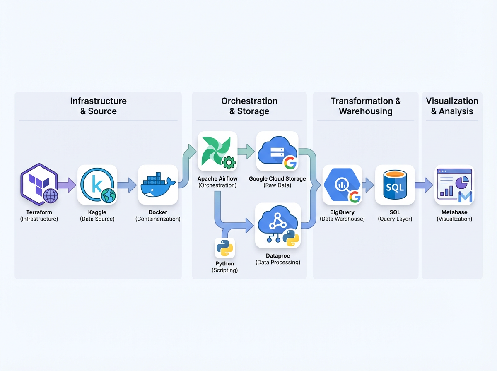
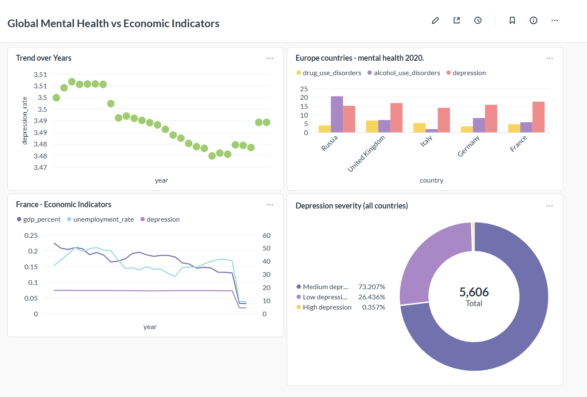

# ETL Zoomcamp Project: Mental Health Data Pipeline

## Overview
This project implements a modern ETL pipeline for integrating and analyzing global datasets on mental health, GDP and unemployment using Apache Airflow, Google Cloud Platform (GCP), PySpark, and Terraform. The primary goal of the project is to explore and demonstrate the relationship between key economic indicators—such as unemployment rates and Gross Domestic Product (GDP)—and the mental health of populations across different countries over time.

To achieve this, three independent datasets were utilized: unemployment statistics, GDP per country, and mental health indicators. These datasets originate from different sources and vary in structure, granularity, and reporting standards. In order to create a unified analytical view, the data is linked using common dimensions—specifically country and year—allowing for consistent cross-dataset comparisons.

The ETL pipeline automates the full data lifecycle. It ingests raw data from Kaggle, performs data cleaning and transformation using PySpark to ensure consistency and quality, and integrates the datasets into a harmonized schema. Apache Airflow orchestrates the workflow, ensuring reliable scheduling, monitoring, and dependency management of each stage in the pipeline. Infrastructure provisioning and configuration are managed through Terraform, enabling reproducibility and scalability in the cloud environment.

The transformed data is then loaded into BigQuery, where it becomes available for advanced analytics, reporting, and visualization. This structured dataset enables deeper insights into how macroeconomic conditions correlate with mental health trends globally.


**Key Features:**
- Automated data ingestion from Kaggle
- Data lake on Google Cloud Storage (GCS)
- Distributed data processing with PySpark on Dataproc
- Data warehouse in BigQuery
- Infrastructure as Code with Terraform
- Jupyter notebooks for analysis

---

## Architecture

<p align="center">
	
</p>

---


## Components

- **Airflow DAG**: Orchestrates the ETL workflow (`airflow-docker/dags/etl_pipeline.py`).
- **Terraform**: Provisions GCP resources (GCS bucket, BigQuery dataset, Dataproc cluster) in `terraform/`.
- **PySpark Jobs**: Data transformations in `airflow-docker/spark_jobs/`.
- **Scripts**: Data ingestion and job upload scripts in `airflow-docker/scripts/`.
- **Jupyter Notebooks**: Data analysis in `notebook/`.

---

## Dataset Schema

| Field Name              | Type    | Mode     | Description |
|------------------------|---------|----------|-------------|
| country                | STRING  | NULLABLE | Country name |
| year                   | INTEGER | NULLABLE | Year |
| schizophrenia          | FLOAT   | NULLABLE | Share of population with schizophrenia |
| bipolar_disorder       | FLOAT   | NULLABLE | Share of population with bipolar disorder |
| eating_disorders       | FLOAT   | NULLABLE | Share of population with eating disorders |
| anxiety_disorders      | FLOAT   | NULLABLE | Share of population with anxiety disorders |
| drug_use_disorders     | FLOAT   | NULLABLE | Share of population with drug use disorders |
| depression             | FLOAT   | NULLABLE | Share of population with depression |
| alcohol_use_disorders  | FLOAT   | NULLABLE | Share of population with alcohol use disorders |
| gdp_percent            | FLOAT   | NULLABLE | GDP expressed as a percentage |
| gdp                    | INTEGER | NULLABLE | Gross Domestic Product |
| unemployment_rate      | FLOAT   | NULLABLE | Unemployment rate |

---


## Setup Instructions

### 0. Clone the Repository

First, clone this repository to your local machine:

```bash
git clone https://github.com/JovankaR/etl-zoomcamp-project.git
cd etl-zoomcamp-project
```

### 1. Infrastructure (Terraform)

Edit `terraform/terraform.tfvars` to provide your GCP project and (optionally) customize region, bucket, and location:

```hcl
gcp_project           = "your-gcp-project-id"      # (Required) Set this to your GCP project
gcp_region            = "europe-west6"             # (Optional) Change if you want a different region
data_lake_bucket_name = "de-zoomcamp-data-lake"    # (Optional) Change if you want a different bucket name
location              = "EU"                       # (Optional) Change if you want a different location
```
Then run:

```bash
cd terraform
terraform init
terraform apply
```

**Note:** Terraform will automatically create a service account with all required permissions for this project. You do not need to manually update any permissions.

After running `terraform apply`, go to the IAM section in your GCP Console, find the service account created by Terraform, and download its JSON key file. This service account will be used by Airflow, Spark, and Metabase to operate all actions in GCP.


### 2. Airflow & Docker


```bash
cd airflow-docker
docker-compose up --build
# Ensure GOOGLE_CREDENTIALS_PATH is set to your GCP credentials JSON
```


### 3. Environment Variables

Set the following in your Airflow environment or .env file:

```ini
# --- REQUIRED: Must be provided by user ---
PROJECT_ID=your-gcp-project-id

# --- KAGGLE: Obtain from Kaggle.com (Account > Create API Token) ---
# To use Kaggle datasets, you must:
# 1. Register for a free account at https://www.kaggle.com/
# 2. Go to your Kaggle profile (top right) > Account
# 3. Scroll down to the "API" section and click "Create New API Token"
# 4. This will download a kaggle.json file containing your username and API key
# 5. Copy the values from kaggle.json and set them below:
KAGGLE_API_TOKEN=your-kaggle-api-token
KAGGLE_USERNAME=your-kaggle-username

# --- OPTIONAL: Only change if you override defaults in terraform/variables.tf or terraform/terraform.tfvars ---
REGION=default-from-terraform
CLUSTER_NAME=default-from-terraform
BUCKET_NAME=default-from-terraform
BQ_DATASET=default-from-terraform
GCS_SPARK_FOLDER=default-from-terraform
SERVICE_ACCOUNT=default-from-terraform
```

**Notes:**
- Only `PROJECT_ID` is strictly required to be set by the user.
- Kaggle API credentials must be generated by signing up at [kaggle.com](https://www.kaggle.com/), then going to Account > Create API Token.
- All other variables should only be set if you change the defaults in `terraform/variables.tf` or `terraform/terraform.tfvars`.


### 4. Data Ingestion & Processing


All steps can be monitored and managed using the Airflow UI, available at [http://localhost:8080](http://localhost:8080) or [http://127.0.0.1:8080](http://127.0.0.1:8080). The UI provides detailed logs and status for each task in the pipeline.

**Airflow UI Login:**
The default username and password for the Airflow UI are:

- Username: `airflow`
- Password: `airflow`

> **⚠️ Note:** Because of Dataproc cluster creation and Spark session initialization, the entire process can take up to **5-6 minutes** to complete.

Airflow DAG will:
1. Create GCS bucket (if needed)
2. Download data from Kaggle and upload to GCS
3. Upload PySpark scripts to GCS
4. Create Dataproc cluster
5. Run PySpark jobs (transform & load to BigQuery)

To view the final data in BigQuery, ensure your personal user account (not the service account) has the BigQuery Dataset Viewer permission for the relevant dataset. Service accounts and user accounts are separate; granting access to one does not automatically grant access to the other.


### 5. Visualization (Metabase)


Metabase will be automatically started by Docker Compose and accessible at [http://localhost:3000](http://localhost:3000) or [http://127.0.0.1:3000](http://127.0.0.1:3000).

**To visualize your data:**
1. Open your browser and go to `http://localhost:3000`.
2. On first login, set up an admin account if prompted.
3. Add a new database connection:
	- Choose **BigQuery** as the database type.
	- Upload the same GCP service account JSON credentials used for Airflow.
	- Enter your GCP project and dataset details.
4. Use Metabase's SQL editor to query your final analysis tables in BigQuery.

5. Create charts and dashboards to visualize your data using Metabase's built-in tools.

#### Sample Queries for Visualization

You can use the following SQL queries in Metabase's SQL editor to quickly create common types of charts:

**Bar Chart Example**

```sql
SELECT
	country,
	drug_use_disorders,
	alcohol_use_disorders,
	depression
FROM mental_health_dw.analytics_final
WHERE country IN ('France', 'Italy', 'Germany', 'United Kingdom', 'Russia')
AND year=2015
```

**Line Chart Example**

```sql
SELECT
	country,
	year,
	gdp_percent,
	unemployment_rate,
	depression
FROM mental_health_dw.analytics_final
WHERE country IN ('France')
```

**Pie Chart Example**

```sql
SELECT
	CASE
		WHEN depression < 3 THEN 'Low depression'
		WHEN depression BETWEEN 3 AND 6 THEN 'Medium depression'
		ELSE 'High depression'
	END AS mental_health_category,
	COUNT(*) AS country_count
FROM mental_health_dw.analytics_final
WHERE year BETWEEN 2010 AND 2020
GROUP BY mental_health_category
```

You can copy and paste these queries into Metabase, then use the visualization options to create bar, line, or pie charts as needed.

<p align="center">
  
</p>

---

## Data Flow

1. **Raw data** downloaded from Kaggle
2. **Uploaded to GCS** (data lake)
3. **PySpark jobs** process and clean data on Dataproc
4. **Transformed data** loaded into BigQuery
5. **Analysis** performed in Jupyter notebooks

---

## Notebooks

See `notebook/` for exploratory data analysis and reporting:
- `mental_health_analysis.ipynb`
- `gdp_analysis.ipynb`
- `unemployment_analysis.ipynb`

---

## Requirements

- Docker, Docker Compose
- Terraform >= 1.5
- GCP account & service account credentials
- Kaggle API credentials

Python dependencies (see `airflow-docker/requirements.txt`):
- pandas, google-cloud-storage, python-dotenv, pyspark, kaggle

---

## Credits

Project for Data Engineering Zoomcamp certification.

